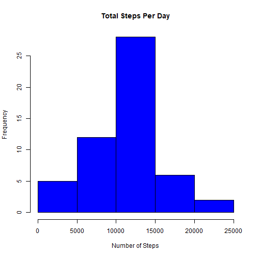
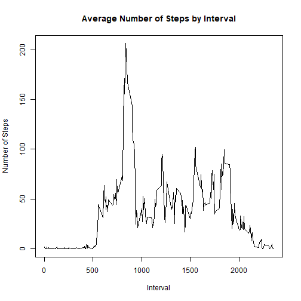
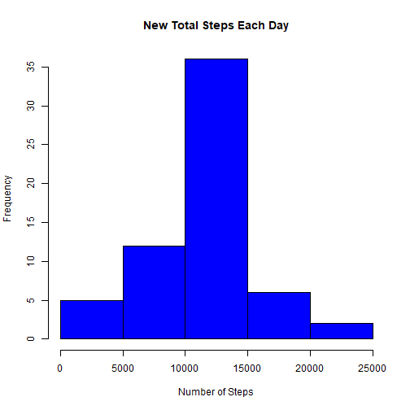
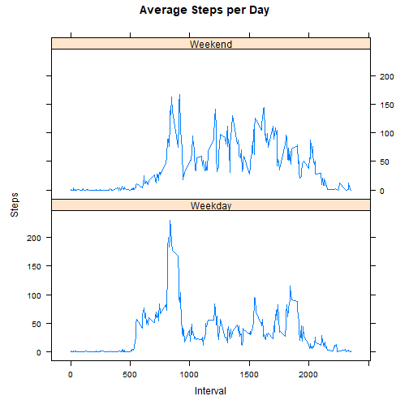

##Setup

```r
knitr::opts_chunk$set(echo = TRUE)
```

##Loading and preprocessing the data

```r
dlurl <- 'http://d396qusza40orc.cloudfront.net/repdata%2Fdata%2Factivity.zip'
download.file(dlurl,destfile='repdata%2Fdata%2Factivity.zip',mode='wb')
unzip('repdata%2Fdata%2Factivity.zip')
data <- read.csv("activity.csv")
```

##What is mean total number of steps taken per day? What are the mean and median daily steps taken?

```r
DailySteps <- aggregate(steps ~ date, data, sum)
hist(DailySteps$steps, main = paste("Total Steps Per Day"), col="blue",xlab="Number of Steps")
```



```r
MeanDailySteps <- mean(DailySteps$steps)
MeanDailySteps
```

```
## [1] 10766.19
```

```r
MedianDailySteps <- median(DailySteps$steps)
MedianDailySteps
```

```
## [1] 10765
```

##What is the average daily activity pattern? What is the maximum interval?

```r
StepInterval <- aggregate(steps ~ interval, data, mean)
plot(StepInterval$interval,StepInterval$steps, type="l", xlab="Interval", ylab="Number of Steps",main="Average Number of Steps by Interval")
```



```r
MaxInterval <- StepInterval[which.max(StepInterval$steps),1]
MaxInterval
```

```
## [1] 835
```

##Imputing missing values, determining the total number of missing values.

```r
TotalNA <- sum(is.na(data))
TotalNA
```

```
## [1] 2304
```

##Imputing missing values, replacing missing values with averaged values and creating a new dataset with them.

```r
AveSteps <- aggregate(steps ~ interval, data, mean)
TotalNA <- numeric()
for (i in 1:nrow(data)) 
    {
          obs <- data[i, ]
          if (is.na(obs$steps)) 
    {
            steps <- subset(AveSteps, interval == obs$interval)$steps
    } 
          else 
    {
          steps <- obs$steps
    }
    TotalNA <- c(TotalNA, steps)
}

NewData <- data
NewData$steps <- TotalNA
```

##Imputing missing values, and create a histogram with replaced missing values.

```r
NewTotalSteps <- aggregate(steps ~ date, data = NewData, sum, na.rm = TRUE)
hist(NewTotalSteps$steps, main = paste("New Total Steps Each Day"), col="blue", xlab="Number of Steps")
```



##Imputing missing values, calculate the mean and median total number of steps.

```r
NewMeanTotal <- mean(NewTotalSteps$steps)
NewMeanTotal
```

```
## [1] 10766.19
```

```r
NewMedianTotal <- median(NewTotalSteps$steps)
NewMedianTotal
```

```
## [1] 10766.19
```

##Imputing missing values, is there a difference between the means and medians?

```r
MeanDailySteps - NewMeanTotal
```

```
## [1] 0
```

```r
MedianDailySteps - NewMedianTotal
```

```
## [1] -1.188679
```

##Imputing missing values, is there a difference between activity patterns between weekdays and weekends?

```r
weekdays <- c("Monday", "Tuesday", "Wednesday", "Thursday", 
              "Friday")
NewData$dow = as.factor(ifelse(is.element(weekdays(as.Date(NewData$date)),weekdays), "Weekday", "Weekend"))
NewTotalSteps <- aggregate(steps ~ interval + dow, NewData, mean)
library(lattice)
xyplot(NewTotalSteps$steps ~ NewTotalSteps$interval|NewTotalSteps$dow, main="Average Steps per Day",xlab="Interval", ylab="Steps",layout=c(1,2), type="l")
```


